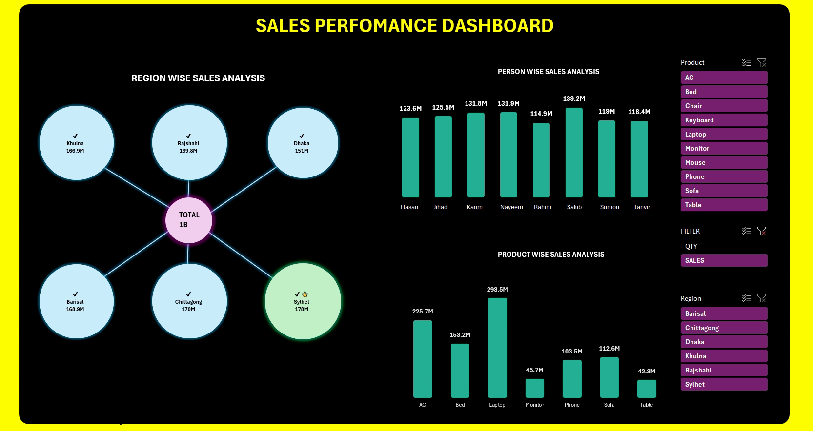
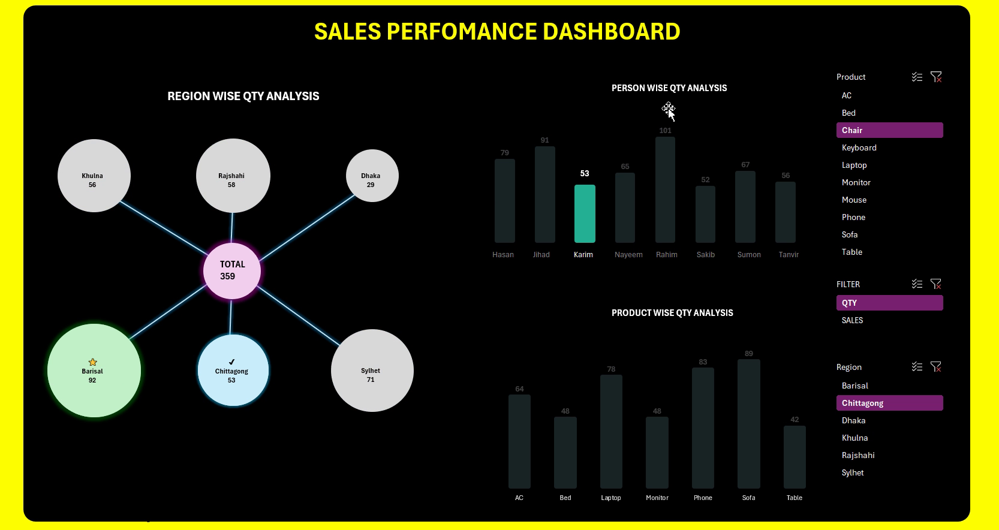
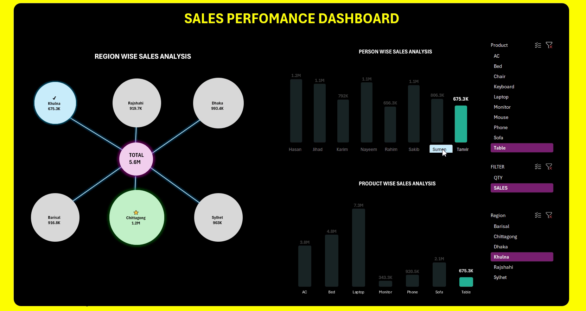

# 📊 Sales Performance Dashboard — Advanced Excel Project

An **interactive, fully dynamic Sales Performance Dashboard** built entirely in Microsoft Excel — combining advanced formulas, slicer-driven cross-filtering, and a custom-designed dark-themed UI to deliver real-time, decision-ready business insights.

This isn't a static report. Every chart, KPI, and node on this dashboard responds instantly to user interaction — letting stakeholders switch between **Sales Value** and **Quantity Sold** with a single click, and drill down by **Region**, **Product**, or **Sales Person** simultaneously.

---

## 🖥️ Dashboard Preview

**Sales View — Full Business Overview**



**Quantity View — Toggled via the QTY/SALES Filter**



**Cross-Filtered View — Region + Product Slicers Combined**



> 🎥 A full interactive walkthrough is available as `INTERACTIVE_DASHBOARD.mp4` in this repository, demonstrating live slicer filtering, the Qty/Sales toggle, and cross-chart highlighting in action.

---

## ✨ Key Features

- **🔄 One-Click Qty ⇄ Sales Toggle Filter**
  A custom slicer instantly switches **every chart, KPI node, and title** across the dashboard between **Sales Value (M)** and **Units Sold (Qty)** — without duplicating a single chart. Built using dynamic measure-switching formulas rather than separate static views.

- **🌐 Region-Wise Radial Network Visualization**
  A custom, formula-driven hub-and-spoke diagram (built with linked shapes, not a default chart type) connects all six regional nodes to a central **TOTAL** node — giving an at-a-glance, visually striking view of regional contribution.

- **🏆 Smart Auto-Highlighting**
  - ⭐ The **top-performing region/category** is automatically highlighted with a star icon — driven live by `MAX`/`MAXIFS` logic, recalculating instantly as filters change.
  - ✔️ A checkmark dynamically marks whichever **Region** is currently active in the slicer, giving instant visual confirmation of the applied filter.

- **🧩 Fully Synchronized Multi-Chart Slicers**
  `Product` and `Region` slicers control **all three visuals simultaneously** — the Region network, the Person-wise chart, and the Product-wise chart all cross-filter together in real time.

- **📊 Three-Dimensional Performance Breakdown**
  - **Region-Wise Sales Analysis** — Khulna, Rajshahi, Dhaka, Barisal, Chittagong, Sylhet
  - **Person-Wise Sales Analysis** — 8 sales representatives ranked side-by-side
  - **Product-Wise Sales Analysis** — 10 product categories spanning electronics & furniture

- **🎨 Premium Custom UI Design**
  Hand-built dark theme with a neon-accent color system (cyan, magenta, lime, gold), custom typography, and a fully borderless, presentation-ready layout — designed to look and feel like a BI tool, built natively in Excel.

---

## 📈 Business Insights Surfaced by the Dashboard

| Dimension | Top Performer | Insight |
|---|---|---|
| **Region** | 🥇 Sylhet (178M) | Sylhet leads all six regions in sales value, narrowly ahead of Chittagong (170M) and Rajshahi (169.8M) — while Dhaka (151M), despite being the largest market, trails behind |
| **Sales Person** | 🥇 Sakib (139.2M) | Sakib is the top individual contributor, outperforming the next-best rep (Nayeem, 131.9M) by a healthy margin — useful for incentive and coaching decisions |
| **Product Category** | 🥇 Laptop (293.5M) | Laptops dominate revenue contribution, followed by AC units (225.7M) — together these two categories anchor the majority of total business volume |
| **Total Business Volume** | **1B+** | Aggregate sales value across all regions, reps, and products — instantly recalculated as any filter is applied |

These insights are **not hard-coded** — they are formula-driven and update automatically the moment a slicer is touched, meaning the same dashboard surfaces *different* leading performers depending on the Region/Product/Qty-Sales context selected.

---

## 🧮 Advanced Excel Techniques Used

This dashboard goes well beyond basic charting. Core techniques include:

- **`SUMIFS` / `COUNTIFS`** — dynamic aggregation of sales value and quantity across Region, Product, and Person dimensions
- **`CHOOSE` / `SWITCH`** — powers the single-slicer **Qty ⇄ Sales toggle**, swapping the underlying measure feeding every chart and KPI node without duplicating visuals
- **`MAX` / `MAXIFS` with array logic** — drives the automatic "top performer" star-highlight across Region, Product, and Person charts
- **Dynamic, formula-linked chart & shape titles** — titles like *"Region Wise Sales Analysis"* automatically relabel themselves to *"Region Wise Qty Analysis"* when the toggle filter changes
- **Cell-linked shapes** — the radial region diagram uses shapes with text linked directly to formula cells, enabling a fully custom visual that updates live (not achievable with stock Excel chart types)
- **Slicers connected to multiple Pivot Tables/data sources simultaneously** — ensures every visual stays perfectly synchronized
- **Conditional Formatting (formula-based)** — drives the star ⭐ and checkmark ✔️ icon logic, and dynamic fill colors on regional nodes
- **`IFERROR` / data validation** — ensures clean output when filters return zero or partial results

---

## 🛠️ Tools & Technologies

- **Microsoft Excel** (Pivot Tables, Slicers, Conditional Formatting)
- **Advanced Excel Formulas** (`SUMIFS`, `MAXIFS`, `CHOOSE`/`SWITCH`, array formulas)
- **Custom Shape-Based Data Visualization**
- **Dashboard UX/UI Design** (custom dark theme, iconography, layout system)

---

## 📂 Repository Structure

```
📦 Sales-Performance-Dashboard
 ┣ 📜 README.md
 ┣ 📊 Sales_Performance_Dashboard.xlsx
 ┣ 🎥 INTERACTIVE_DASHBOARD.mp4
 ┗ 📁 screenshots
    ┣ dashboard-sales-view.png
    ┣ dashboard-qty-view.png
    ┗ dashboard-cross-filter-view.png
```

> ℹ️ Place your actual `.xlsx` workbook in the repository root (update the filename above to match) so the structure stays accurate.

---

## 🚀 How to Use

1. Download/clone the repository and open `Sales_Performance_Dashboard.xlsx` in Microsoft Excel (2016 or later recommended for full slicer support).
2. Use the **Product** and **Region** slicers on the right panel to filter the entire dashboard — all three charts update together.
3. Click **QTY** or **SALES** in the Filter panel to instantly toggle every chart and KPI between **Quantity Sold** and **Sales Value**.
4. Click directly on any regional node in the **Region Wise Analysis** diagram to drill into that region across all other visuals.
5. Watch `INTERACTIVE_DASHBOARD.mp4` for a complete guided walkthrough of all interactions.

---

## 📌 Future Enhancements

- [ ] Power Query integration for automated data refresh from external sources

---

## 👤 Author

Built and designed as an end-to-end Excel project — combining advanced formula engineering with custom dashboard design to turn raw sales data into an interactive decision-making tool.

⭐ If you find this project useful, consider starring the repo!
